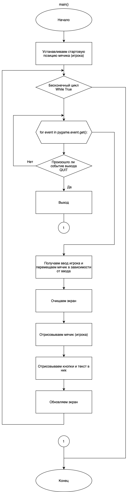

# Практическая работа №23 #

### Тема: Применение библиотек анимации ###

### Цель: Совершенствование навыков составления программ с библиотекой Pygame ###

#### Задача: ####

> Создайте анимацию своей игры, продберите скорость движения объектов

##### Контрольный пример: #####

> Получаю:
> 1) Создана анимация движения игрока и подобрана скорость;
> 2) Добавлено фоновое изображение.

##### Системный анализ: #####

> Входные данные: `None`    
> Промежуточные данные: `int screen_width`, `int screen_height`, `tuple black`, `tuple green`, `int player_radius`,
`int player_speed`, `int player_x`, `int player_y`, `list lines`, `int num_openings`, `list openings`,
`int last_opening_bottom`        
> Выходные данные: `background_image`

##### Блок схема: #####



##### Код программы: #####

```python
import pygame

# Инициализация Pygame
pygame.init()

# Ширина и высота экрана
screen_width = 640
screen_height = 520
screen = pygame.display.set_mode((screen_width, screen_height))
pygame.display.set_caption('Мячик')

# Цвета
black = (0, 0, 0)
green = (0, 255, 0)

# Параметры игрока и начальная позиция
player_radius = 10
player_speed = 2
player_x = screen_width // 2  # Начальная позиция по горизонтали
player_y = screen_height // 2  # Начальная позиция по вертикали

# Загрузка и масштабирование фонового изображения
background_image = pygame.image.load('background.jpg')
background_image = pygame.transform.scale(background_image, (screen_width, screen_height))


# Основная функция
def main():
    global player_x, player_y
    clock = pygame.time.Clock()

    while True:
        for event in pygame.event.get():
            if event.type == pygame.QUIT:
                pygame.quit()
                quit()

        # Движение игрока
        keys = pygame.key.get_pressed()
        if keys[pygame.K_LEFT] and player_x > player_radius:
            player_x -= player_speed
        elif keys[pygame.K_RIGHT] and player_x < screen_width - player_radius:
            player_x += player_speed
        elif keys[pygame.K_UP] and player_y > player_radius:
            player_y -= player_speed
        elif keys[pygame.K_DOWN] and player_y < screen_height - player_radius:
            player_y += player_speed

        # Очистка экрана
        screen.blit(background_image, (0, 0))  # Отображение фонового изображения

        # Отрисовка игрока
        pygame.draw.circle(screen, green, (player_x, player_y), player_radius)

        pygame.display.update()
        clock.tick(60)  # Поддержка 60 кадров в секунду


# Запуск основной функции
if __name__ == "__main__":
    main()
```

##### Результат работы программы: #####


##### Контрольные вопросы: #####

1. Модули для работы программы:  
   `pygame`: Библиотека для создания игр, обеспечивающая работу с графикой, звуком и событиями.

2. Функции для работы программы:  
   `main()`: Основная функция программы, управляющая логикой игры, обработкой событий, движением игрока и отрисовкой
   элементов на экране.

##### Вывод по проделанной работе: #####

> В ходе данной практики я добавил в свою игру игру анимацию, подобрал ей скорость и добавил задний фон.
